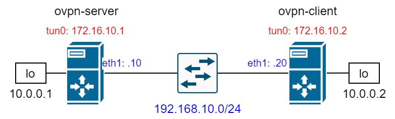

**Задание**

1. Между двумя виртуалками поднять vpn в режимах
- tun
- tap
Прочуствовать разницу.

2. Поднять RAS на базе OpenVPN с клиентскими сертификатами, подключиться с локальной машины на виртуалку

***Топология сети***



**Выполнение задания**

***Между двумя виртуалками поднять vpn в режимах***
***- tun***
***- tap***
***Прочуствовать разницу.***

1. Установим `epel-репозиторий`:
```
[root@ovpn-server ~]# yum install -y epel-release
[root@ovpn-client ~]# yum install -y epel-release
```

2. Установим пакеты `openvpn`, `easy-rsa`, `iperf3`:
```
[root@ovpn-server ~]# yum install -y openvpn easy-rsa iperf3
[root@ovpn-client ~]# yum install -y openvpn iperf3
```

3. Назначим дополнительный IP-адрес на loopback-интерфейс:
```
[root@ovpn-server ~]# cat > /etc/sysconfig/network-scripts/ifcfg-lo.2 <<EOF
DEVICE=lo:2
IPADDR=10.0.0.1
PREFIX=32
NETWORK=10.0.0.1
ONBOOT=yes
EOF

[root@ovpn-client ~]# cat > /etc/sysconfig/network-scripts/ifcfg-lo.2 <<EOF
DEVICE=lo:2
IPADDR=10.0.0.2
PREFIX=32
NETWORK=10.0.0.2
ONBOOT=yes
EOF
```

4. Включим forwarding пакетов между интерфейсами и перезапустим `network.service`:
```
[root@ovpn-server ~]# echo "net.ipv4.ip_forward = 1" > /etc/sysctl.d/ip_forwarding.conf && systemctl restart network
[root@ovpn-client ~]# echo "net.ipv4.ip_forward = 1" > /etc/sysctl.d/ip_forwarding.conf && systemctl restart network
```

***Настройка сервера***

5. Сгенерируем секретный ключ:
```
[root@ovpn-server ~]# openvpn --genkey --secret /etc/openvpn/static.key
```

6. Создадим конфигурационный файл сервера для tap режима:
```
[root@ovpn-server ~]# cat > /etc/openvpn/server.conf <<EOF
dev tap
ifconfig 172.16.10.1 255.255.255.0
topology subnet
route 10.0.0.2 255.255.255.255 172.16.10.2
secret /etc/openvpn/static.key
compress lzo
status /var/log/openvpn-status.log
log /var/log/openvpn.log
verb 3
EOF
```

7. Запускаем сервис и добавляем в автозагрузку:
```
[root@ovpn-server ~]# systemctl enable --now openvpn@server
Created symlink from /etc/systemd/system/multi-user.target.wants/openvpn@server.service to /usr/lib/systemd/system/openvpn@.service.
[root@ovpn-server ~]# systemctl status openvpn@server
● openvpn@server.service - OpenVPN Robust And Highly Flexible Tunneling Application On server
   Loaded: loaded (/usr/lib/systemd/system/openvpn@.service; enabled; vendor preset: disabled)
   Active: active (running) since Fri 2020-06-19 14:52:56 UTC; 6s ago
 Main PID: 2990 (openvpn)
   Status: "Pre-connection initialization successful"
   CGroup: /system.slice/system-openvpn.slice/openvpn@server.service
           └─2990 /usr/sbin/openvpn --cd /etc/openvpn/ --config server.conf
```

***Настройка клиента***

8. В файл `/etc/openvpn/static.key` скопируем секретный ключ с сервера:
```
[root@ovpn-client ~]# cat > /etc/openvpn/static.key <<EOF
#
# 2048 bit OpenVPN static key
#
-----BEGIN OpenVPN Static key V1-----
f22cd1e5b15c30c1a50178b2d14df740
8bc1d6c61605c8668836989d66dae390
50f58aa9694f394f1b7571a4f4ed441e
bcf9e9af07d3f9711ff7db39ba5fd937
cd9e1571d937a6b01515cb4452f7cd16
69ef74a7d70429a3e70a201d09595f19
bd6fedcc6adb127fecbc1285a8197d8e
50b4e4bfac627f749563e115c9a7cc07
f29a5ce908b23b55cd69945efd94b62a
16b8b1363c6502a27c9e1ea19b18503e
02d0d17be488abaf65d0e2a90373ea0b
e6d52bca4ebff68963aa02ad5fd15483
217a71690efc304f48e7d16189120055
68b37becc9216b0817bf3f641da9c4e8
d82d8c3b6d322d24a8aaf39c24e4b97a
db5b7f2d46b126b141a779f28ea60bdd
-----END OpenVPN Static key V1-----
EOF
```

9. Создадим конфигурационный файл клиента для tap режима:
```
[root@ovpn-client ~]# cat > /etc/openvpn/server.conf <<EOF
dev tap
remote 192.168.10.10
ifconfig 172.16.10.2 255.255.255.0
topology subnet
route 10.0.0.1 255.255.255.255 172.16.10.1
secret /etc/openvpn/static.key
compress lzo
status /var/log/openvpn-status.log
log /var/log/openvpn.log
verb 3
EOF
```

10. Запускаем сервис и добавляем в автозагрузку:
```
[root@ovpn-client ~]# systemctl enable --now openvpn@server
Created symlink from /etc/systemd/system/multi-user.target.wants/openvpn@server.service to /usr/lib/systemd/system/openvpn@.service.
[root@ovpn-client ~]# systemctl status openvpn@server
● openvpn@server.service - OpenVPN Robust And Highly Flexible Tunneling Application On server
   Loaded: loaded (/usr/lib/systemd/system/openvpn@.service; enabled; vendor preset: disabled)
   Active: active (running) since Fri 2020-06-19 15:01:53 UTC; 5s ago
 Main PID: 2937 (openvpn)
   Status: "Pre-connection initialization successful"
   CGroup: /system.slice/system-openvpn.slice/openvpn@server.service
           └─2937 /usr/sbin/openvpn --cd /etc/openvpn/ --config server.conf
```

11. Проверим наличие маршрутов до лупбеков и доступность лупбеков:
```
[root@ovpn-server ~]# ip r
default via 10.0.2.2 dev eth0 proto dhcp metric 100 
10.0.0.2 via 172.16.10.2 dev tap0 
10.0.2.0/24 dev eth0 proto kernel scope link src 10.0.2.15 metric 100 
172.16.10.0/24 dev tap0 proto kernel scope link src 172.16.10.1 
192.168.10.0/24 dev eth1 proto kernel scope link src 192.168.10.10 metric 101 
[root@ovpn-server ~]# ping -I 10.0.0.1 10.0.0.2
PING 10.0.0.2 (10.0.0.2) from 10.0.0.1 : 56(84) bytes of data.
64 bytes from 10.0.0.2: icmp_seq=1 ttl=64 time=0.500 ms
64 bytes from 10.0.0.2: icmp_seq=2 ttl=64 time=1.96 ms
```
```
[root@ovpn-client ~]# ip r
default via 10.0.2.2 dev eth0 proto dhcp metric 100 
10.0.0.1 via 172.16.10.1 dev tap0 
10.0.2.0/24 dev eth0 proto kernel scope link src 10.0.2.15 metric 100 
172.16.10.0/24 dev tap0 proto kernel scope link src 172.16.10.2 
192.168.10.0/24 dev eth1 proto kernel scope link src 192.168.10.20 metric 101 
[root@ovpn-client ~]# ping -I 10.0.0.2 10.0.0.1
PING 10.0.0.1 (10.0.0.1) from 10.0.0.2 : 56(84) bytes of data.
64 bytes from 10.0.0.1: icmp_seq=1 ttl=64 time=1.26 ms
64 bytes from 10.0.0.1: icmp_seq=2 ttl=64 time=1.37 ms
```

12. Измерим скорость в туннеле. Для этого запускаем `iperf3` на сервере в режиме сервера:
```
[root@ovpn-server ~]# iperf3 -s
```

На клиенте в режиме клиента запускаем тест:
```
[root@ovpn-client ~]# iperf3 -c 172.16.10.1 -t 40 -i 5
```

Получаем следующий результат:
```
[ ID] Interval           Transfer     Bandwidth       Retr
[  4]   0.00-40.01  sec  1.10 GBytes   236 Mbits/sec  749             sender
[  4]   0.00-40.01  sec  1.10 GBytes   235 Mbits/sec                  receiver
```

13. Изменим в конфигах `/etc/openvpn/server.conf` на сервере и клиенте режим с `tap` на `tun`:
```
[root@ovpn-server ~]# cat /etc/openvpn/server.conf
dev tun
ifconfig 172.16.10.1 255.255.255.0
topology subnet
route 10.0.0.2 255.255.255.255 172.16.10.2
secret /etc/openvpn/static.key
compress lzo
status /var/log/openvpn-status.log
log /var/log/openvpn.log
verb 3
```
```
[root@ovpn-client ~]# cat /etc/openvpn/server.conf 
dev tun 
remote 192.168.10.10
ifconfig 172.16.10.2 255.255.255.0
topology subnet
route 10.0.0.1 255.255.255.255 172.16.10.1
secret /etc/openvpn/static.key
compress lzo
status /var/log/openvpn-status.log
log /var/log/openvpn.log
verb 3
```

14. Рестартанем сервис `openvpn` и измерим скорость снова. Получим следующие результаты:
```
[ ID] Interval           Transfer     Bandwidth       Retr
[  4]   0.00-40.00  sec  1.13 GBytes   243 Mbits/sec  615             sender
[  4]   0.00-40.00  sec  1.13 GBytes   242 Mbits/sec                  receiver
```

В лабораторной среде результаты в режиме `tun` немного лучше, но на реальных сетях разница будет существенной. Поэтому режим `tap` рекомендуется использовать в специфических задачах, например, если в архитектуре сети необходимо достичь связности по L2, в остальных же случаях нужно использовать режим `tun`.


***Поднять RAS на базе OpenVPN с клиентскими сертификатами.***

1. На сервере переходим в директорию `/etc/openvpn` и инициализируем pki:
```
[root@ovpn-server openvpn]# /usr/share/easy-rsa/3.0.7/easyrsa init-pki

init-pki complete; you may now create a CA or requests.
Your newly created PKI dir is: /etc/openvpn/pki

```

2. Сгенерируем необходимые ключи и сертификаты для сервера.

Генерация корневого сертификата:
```
[root@ovpn-server openvpn]# echo 'rasvpn' | /usr/share/easy-rsa/3.0.7/easyrsa build-ca nopass
Using SSL: openssl OpenSSL 1.0.2k-fips  26 Jan 2017
Generating RSA private key, 2048 bit long modulus
.................+++
...................................................................+++
e is 65537 (0x10001)
You are about to be asked to enter information that will be incorporated
into your certificate request.
What you are about to enter is what is called a Distinguished Name or a DN.
There are quite a few fields but you can leave some blank
For some fields there will be a default value,
If you enter '.', the field will be left blank.
-----
Common Name (eg: your user, host, or server name) [Easy-RSA CA]:
CA creation complete and you may now import and sign cert requests.
Your new CA certificate file for publishing is at:
/etc/openvpn/pki/ca.crt
```

Создаем запрос на сертификат для сервера:
```
[root@ovpn-server openvpn]# echo 'rasvpn' | /usr/share/easy-rsa/3.0.7/easyrsa gen-req server nopass
Using SSL: openssl OpenSSL 1.0.2k-fips  26 Jan 2017
Generating a 2048 bit RSA private key
............................+++
.......................+++
writing new private key to '/etc/openvpn/pki/easy-rsa-3835.vWmCgv/tmp.dDWR0m'
-----
You are about to be asked to enter information that will be incorporated
into your certificate request.
What you are about to enter is what is called a Distinguished Name or a DN.
There are quite a few fields but you can leave some blank
For some fields there will be a default value,
If you enter '.', the field will be left blank.
-----
Common Name (eg: your user, host, or server name) [server]:
Keypair and certificate request completed. Your files are:
req: /etc/openvpn/pki/reqs/server.req
key: /etc/openvpn/pki/private/server.key
```

Создаем и подписываем сертификат сервера:
```
[root@ovpn-server openvpn]# echo 'yes' | /usr/share/easy-rsa/3.0.7/easyrsa sign-req server server
Using SSL: openssl OpenSSL 1.0.2k-fips  26 Jan 2017


You are about to sign the following certificate.
Please check over the details shown below for accuracy. Note that this request
has not been cryptographically verified. Please be sure it came from a trusted
source or that you have verified the request checksum with the sender.

Request subject, to be signed as a server certificate for 825 days:

subject=
    commonName                = rasvpn


Type the word 'yes' to continue, or any other input to abort.
  Confirm request details: Using configuration from /etc/openvpn/pki/easy-rsa-3864.mA6XYg/tmp.FehfdS
Check that the request matches the signature
Signature ok
The Subject's Distinguished Name is as follows
commonName            :ASN.1 12:'rasvpn'
Certificate is to be certified until Sep 22 16:21:00 2022 GMT (825 days)

Write out database with 1 new entries
Data Base Updated

Certificate created at: /etc/openvpn/pki/issued/server.crt
```

Генерируем ключи Диффи-Хелмана:
```
[root@ovpn-server openvpn]# /usr/share/easy-rsa/3.0.7/easyrsa gen-dh
...
..............................................+...................+....................................................................................................................................................................................................++*++*

DH parameters of size 2048 created at /etc/openvpn/pki/dh.pem
```

Создадим секретный ключ (`/etc/openvpn/ta.key`), который используется для дополнительной tls-аутентификации:
```
[root@ovpn-server openvpn]# openvpn --genkey --secret ta.key
```

3. Сгенерируем сертификаты для клиента:
```
[root@ovpn-server openvpn]# echo 'client' | /usr/share/easy-rsa/3.0.7/easyrsa gen-req client nopass
Using SSL: openssl OpenSSL 1.0.2k-fips  26 Jan 2017
Generating a 2048 bit RSA private key
.........................................................................................................................+++
..........................+++
writing new private key to '/etc/openvpn/pki/easy-rsa-3969.R2R7yY/tmp.hphWBl'
-----
You are about to be asked to enter information that will be incorporated
into your certificate request.
What you are about to enter is what is called a Distinguished Name or a DN.
There are quite a few fields but you can leave some blank
For some fields there will be a default value,
If you enter '.', the field will be left blank.
-----
Common Name (eg: your user, host, or server name) [client]:
Keypair and certificate request completed. Your files are:
req: /etc/openvpn/pki/reqs/client.req
key: /etc/openvpn/pki/private/client.key
```
```
[root@ovpn-server openvpn]# echo 'yes' | /usr/share/easy-rsa/3.0.7/easyrsa sign-req client client
Using SSL: openssl OpenSSL 1.0.2k-fips  26 Jan 2017


You are about to sign the following certificate.
Please check over the details shown below for accuracy. Note that this request
has not been cryptographically verified. Please be sure it came from a trusted
source or that you have verified the request checksum with the sender.

Request subject, to be signed as a client certificate for 825 days:

subject=
    commonName                = client


Type the word 'yes' to continue, or any other input to abort.
  Confirm request details: Using configuration from /etc/openvpn/pki/easy-rsa-3999.FvRNlB/tmp.MOcP3M
Check that the request matches the signature
Signature ok
The Subject's Distinguished Name is as follows
commonName            :ASN.1 12:'client'
Certificate is to be certified until Sep 22 16:38:50 2022 GMT (825 days)

Write out database with 1 new entries
Data Base Updated

Certificate created at: /etc/openvpn/pki/issued/client.crt
```

4. Изменим конфигурационный файл сервера и рестартанем сервис:
```
[root@ovpn-server ~]# cat > /etc/openvpn/server.conf <<EOF
port 1194
proto udp
dev tun
ca /etc/openvpn/pki/ca.crt
cert /etc/openvpn/pki/issued/server.crt
key /etc/openvpn/pki/private/server.key
dh /etc/openvpn/pki/dh.pem
server 172.16.10.0 255.255.255.0
route 10.0.0.2 255.255.255.255
push "route 10.0.0.1 255.255.255.255"
client-to-client
client-config-dir /etc/openvpn/client
keepalive 10 120
compress lzo
persist-key
persist-tun
status /var/log/openvpn-status.log
log /var/log/openvpn.log
verb 3
EOF
```
```
[root@ovpn-server ~]# systemctl restart openvpn@server
```

5. Далее нужно скопировать на клиент следующие файлы (рекомендуется расположить их в той же директории, где лежит client.conf):
`/etc/openvpn/pki/ca.crt`
`/etc/openvpn/pki/issued/client.crt`
`/etc/openvpn/pki/private/client.key`

6. Создадим конфигурационный файл на клиенте, остановим openvpn@server и запустим openvpn@client:
```
[root@ovpn-client ~]# cat > /etc/openvpn/client.conf <<EOF
dev tun
proto udp
remote 192.168.10.10 1194
client
resolv-retry infinite
ca ./ca.crt
cert ./client.crt
key ./client.key
compress lzo
persist-key
persist-tun
status /var/log/openvpn-client-status.log
log-append /var/log/openvpn-client.log
verb 3
EOF
```
```
[root@ovpn-client ~]# systemctl stop openvpn@server && systemctl enable --now openvpn@client
```

7. Подключаемся к серверу с клиента:
```
[root@ovpn-client ~]# openvpn --config /etc/openvpn/client.conf
```

8. Проверим доступность лупбэка на машине ovpn-server:
```
[root@ovpn-client ~]# ping 10.0.0.1
PING 10.0.0.1 (10.0.0.1) 56(84) bytes of data.
64 bytes from 10.0.0.1: icmp_seq=1 ttl=64 time=0.592 ms
64 bytes from 10.0.0.1: icmp_seq=2 ttl=64 time=1.60 ms
```

**Проверка ДЗ**

Выполнить `vagrant up`, после чего поднимется стенд в конфигурации site-to-site с использованием общего секретного ключа в режиме `tap`. Для изменения режима open-vpn необходимо в `./inventories/host_vars/ovpn-server.yml` и в `./inventories/host_vars/ovpn-client.yml` изменить значение переменной `stsdev` на `'tun'`, после чего выполнить плейбук `site-to-site.yml`.

Для изменения конфигурации стенда на remote-access необходимо выполнить плейбук `remote-access.yml`, после чего на хосте ovpn-server поменяется `server.conf`, openvpn будет слушать на нестандартном порту 1195, а хост ovpn-client подключится к серверу с помощью конфига client.conf.


